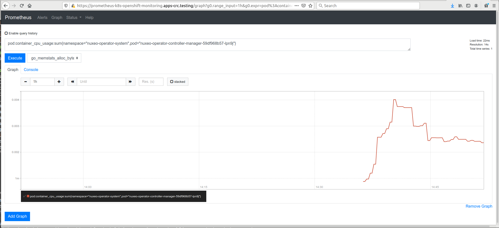
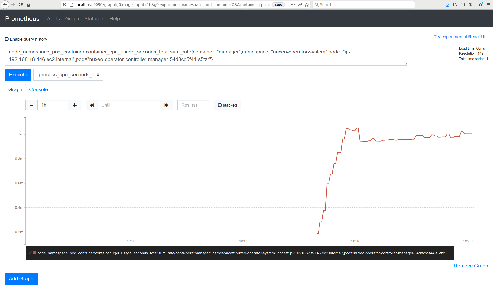

# Nuxeo Operator metrics

The Nuxeo Operator is scaffolded using the Operator SDK v1.0.0. The scaffolding includes default support for Prometheus metrics. To verify the functionality of the metrics, perform the following steps.

These steps assume you have git cloned the Operator repo and are logged into a Kubernetes cluster with cluster admin privileges.

These steps describe the process of verifying metrics support in OpenShift Code Ready Containers (CRC), as well as Amazon Elastic Kubernetes Service (EKS). The tested EKS cluster was provisioned with the `eksctl` utility: https://eksctl.io

### Install the Nuxeo Operator into the Kubernetes cluster

```shell
$ make operator-install 
No resources found
namespace/nuxeo-operator-system created
customresourcedefinition.apiextensions.k8s.io/nuxeos.appzygy.net created
serviceaccount/nuxeo-operator-manager created
role.rbac.authorization.k8s.io/nuxeo-operator-leader-election created
clusterrole.rbac.authorization.k8s.io/nuxeo-operator-manager created
clusterrole.rbac.authorization.k8s.io/nuxeo-operator-proxy created
clusterrole.rbac.authorization.k8s.io/nuxeo-operator-metrics-reader created
rolebinding.rbac.authorization.k8s.io/nuxeo-operator-leader-election created
clusterrolebinding.rbac.authorization.k8s.io/nuxeo-operator-manager created
clusterrolebinding.rbac.authorization.k8s.io/nuxeo-operator-proxy created
service/nuxeo-operator-metrics-service created
deployment.apps/nuxeo-operator-controller-manager created
```
The `operator-install` Make target creates a namespace `nuxeo-operator-system` and installs the Operator and RBACs into that namespace, and the CRD into the cluster.

### Ensure the Operator is running successfully

Verify the Nuxeo Operator is running:

```shell
$ kubectl get pod -n nuxeo-operator-system
NAME                                                 READY     STATUS    RESTARTS   AGE
nuxeo-operator-controller-manager-59df968b57-lpn9j   2/2       Running   0          16s
```

### Ensure Kubernetes Telemetry is running

With CRC, according to [this documentation](https://code-ready.github.io/crc/#administrative-tasks_gsg), Prometheus and the related monitoring, alerting, and telemetry are disabled by default, and the link has instructions for enabling them. Instructions are presented here for convenience:

```shell
$ oc get clusterversion version\
  -ojsonpath='{range .spec.overrides[*]}{.name}{"\n"}{end}' | nl -v 0
     0	cluster-monitoring-operator
     1	machine-config-operator
     2	etcd-quorum-guard
     ...

# Remove this override:
# spec:
  ...
#   overrides:
#   - group: apps/v1
#     kind: Deployment
#     name: cluster-monitoring-operator
#     namespace: openshift-monitoring
#     unmanaged: true

$ oc patch clusterversion/version --type='json' -p '[{"op":"remove", "path":"/spec/overrides/0"}]' -oyaml
```

With that, the `openshift-monitoring` namespace comes up as shown:

```shell
$ oc get po -n openshift-monitoring
NAME                                          READY     STATUS    RESTARTS   AGE
alertmanager-main-0                           5/5       Running   0          60s
alertmanager-main-1                           5/5       Running   0          60s
alertmanager-main-2                           5/5       Running   0          60s
cluster-monitoring-operator-f76d748f6-6cmdr   2/2       Running   0          82s
grafana-f457c8645-g5b2s                       2/2       Running   0          48s
kube-state-metrics-5b557cf9c6-6pnwv           3/3       Running   0          73s
node-exporter-sc86d                           2/2       Running   0          67s
openshift-state-metrics-7db99f498c-bvlb2      3/3       Running   0          72s
prometheus-adapter-5596d657c8-zn5ft           1/1       Running   0          52s
prometheus-adapter-5596d657c8-zrc8k           1/1       Running   0          52s
prometheus-k8s-0                              7/7       Running   1          50s
prometheus-k8s-1                              7/7       Running   1          50s
prometheus-operator-66f6479d8c-vfk2l          2/2       Running   0          70s
telemeter-client-596fbf7b4d-pzzjq             3/3       Running   0          57s
thanos-querier-755f6677b6-6ndtq               4/4       Running   0          53s
thanos-querier-755f6677b6-pk7fq               4/4       Running   0          53s
```

With EKS, monitoring has to be installed as documented in https://github.com/prometheus-operator/kube-prometheus#kube-prometheus. The steps are straightforward:

```shell
$ git clone https://github.com/prometheus-operator/kube-prometheus.git
$ cd kube-prometheus
$ kubectl create -f manifests/setup
$ until kubectl get servicemonitors --all-namespaces ; do date; sleep 1; echo ""; done
$ kubectl create -f manifests/

$ kubectl get pod -n monitoring
NAME                                   READY   STATUS    RESTARTS   AGE
alertmanager-main-0                    2/2     Running   0          52s
alertmanager-main-1                    2/2     Running   0          52s
alertmanager-main-2                    2/2     Running   0          52s
grafana-85c89999cb-gp44f               1/1     Running   0          51s
kube-state-metrics-6b7567c4c7-8r5tk    3/3     Running   0          51s
node-exporter-2nvxr                    2/2     Running   0          50s
node-exporter-xrv98                    2/2     Running   0          50s
prometheus-adapter-b8d458474-c6s9j     1/1     Running   0          50s
prometheus-k8s-0                       3/3     Running   1          49s
prometheus-k8s-1                       3/3     Running   1          49s
prometheus-operator-55cb794976-h9nwk   2/2     Running   0          87s

# give the Prometheus service account access to the Nuxeo Operator metrics endpoint
# using the clusterrole provided by the Nuxeo Operator installation YAML
$ kubectl create clusterrolebinding metrics\
  --clusterrole=nuxeo-operator-metrics-reader\
  --serviceaccount=monitoring:prometheus-k8s
```

Now, monitoring is running. Before using Prometheus, it's interesting to see what metrics the Nuxeo Operator is actually exposing. That's next.

### Port-forward to the Operator pod in one shell

Since there is no Route or Ingress for the Operator Pod, use port-forwarding to access the metrics endpoint (8443) on the Operator Pod:

```shell
$ kubectl port-forward -n nuxeo-operator-system\
  nuxeo-operator-controller-manager-59df968b57-lpn9j 8443
Forwarding from 127.0.0.1:8443 -> 8443
Forwarding from [::1]:8443 -> 8443
```
Use port 8443 because that's the port that the metrics are published to. (The *kube-auth-proxy* sidecar in the Operator Pod exposes the metrics.)

Next, get a token. You need a token because the metrics *kube-auth-proxy* uses RBAC to authenticate and authorize a client's metric request. On CRC, the `oc whoami -t` command provides a kube:admin level token which is sufficient to curl the metrics endpoint. For EKS, you get the token from the Prometheus service account that you previously granted permissions to for the Operator metrics endpoint:

```shell
# OpenShift CRC get the kube:admin token
$ TOKEN=$(oc whoami -t)

# EKS get the Prometheus service account token
$ TOKENSECRET=$(oc describe sa prometheus-k8s -nmonitoring | grep Tokens\
 | cut -d: -f2 | tr -d ' ')
$ TOKEN=$(kubectl get secret "$TOKENSECRET" -nmonitoring\
 -ojsonpath='{.data.token}' | base64 -d)
```
### Access the metrics via curl

In another shell, use curl with your token to see the raw metrics exposed by the Operator:

```shell
$ curl -k https://localhost:8443/metrics\
  -H "Accept: application/json"\
  -H "Authorization: Bearer $TOKEN"
# HELP go_gc_duration_seconds A summary of the GC invocation durations.
# TYPE go_gc_duration_seconds summary
go_gc_duration_seconds{quantile="0"} 7.198e-06
go_gc_duration_seconds{quantile="0.25"} 3.055e-05
go_gc_duration_seconds{quantile="0.5"} 6.883e-05
go_gc_duration_seconds{quantile="0.75"} 0.000689496
go_gc_duration_seconds{quantile="1"} 0.010060858
go_gc_duration_seconds_sum 0.01283921
go_gc_duration_seconds_count 12
# HELP go_goroutines Number of goroutines that currently exist.
# TYPE go_goroutines gauge
go_goroutines 81
# HELP go_info Information about the Go environment.
# TYPE go_info gauge
go_info{version="go1.13.15"} 1
# HELP go_memstats_alloc_bytes Number of bytes allocated and still in use.
# TYPE go_memstats_alloc_bytes gauge
go_memstats_alloc_bytes 7.9765688e+07
# HELP go_memstats_alloc_bytes_total Total number of bytes allocated, even if freed.
# TYPE go_memstats_alloc_bytes_total counter
go_memstats_alloc_bytes_total 2.13977776e+08
# HELP go_memstats_buck_hash_sys_bytes Number of bytes used by the profiling bucket hash table.
# TYPE go_memstats_buck_hash_sys_bytes gauge
go_memstats_buck_hash_sys_bytes 1.475731e+06
# HELP go_memstats_frees_total Total number of frees.
# TYPE go_memstats_frees_total counter
go_memstats_frees_total 213336

<remainder deleted for brevity>
```

You can see that the curl request returned a lengthy text output of metric information. If you're familiar with Prometheus metrics, this format will look familiar. If you've never looked at raw Prometheus metrics, they consist of two `# HELP` lines, following by a set of metrics.

### Verify the Metrics in Prometheus

Now that we've seen the raw metrics exposed by the Operator, we can verify the metrics availability in Prometheus. The earlier part of this document provided the steps for installing and enabling telemetry.

First, CRC will be discussed, then EKS.

#### CRC

With `crc console`, from the `Monitoring > Metrics` link in the console sidebar,  You can click the `Prometheus UI` link which takes you to the Prometheus UI. Or:

```shell
$ kubectl get route -n openshift-monitoring
NAME                HOST/PORT                                             ...
...
prometheus-k8s      prometheus-k8s-openshift-monitoring.apps-crc.testing  ...
...
```

Then, in a browser tab, access `https://prometheus-k8s-openshift-monitoring.apps-crc.testing`. Login with `kube:admin`. Supply credentials from `crc console --credentials`. 

In CRC, Prometheus immediately had access to the Nuxeo Operator metrics. For example, using the following Prometheus query: `pod:container_cpu_usage:sum{namespace="nuxeo-operator-system",pod="nuxeo-operator-controller-manager-59df968b57-lpn9j"}`, the following graph is produced  in Prometheus without requiring any additional RBAC configuration:



#### EKS

With EKS, port-forward to the Prometheus service in the cluster:

```shell
$ kubectl --namespace monitoring port-forward svc/prometheus-k8s 9090
Forwarding from 127.0.0.1:9090 -> 9090
Forwarding from [::1]:9090 -> 9090
```

Then access Prometheus using `http://localhost:9090` and run this Prometheus query: `node_namespace_pod_container:container_cpu_usage_seconds_total:sum_rate{container="manager",namespace="nuxeo-operator-system",node="ip-192-168-18-146.ec2.internal",pod="nuxeo-operator-controller-manager-54d8cb5f44-s5tzr"}`.

If you click on the `Graph` tab, you should get some nice output from the EKS cluster just like you did from the CRC cluster:



### Summary

You will notice that the available set of Prometheus metrics in CRC and EKS differ. This is due to differences in how the Prometheus scraping is configured between the two telemetry implementations. We proved that because the raw metrics exposed by the Nuxeo Operator are not cognizant of the consumer. Therefore the differences must be attributable to the different Prometheus implementations.

This should demonstrate that the Nuxeo Operator is configured for Prometheus metric exposition out of the box.

